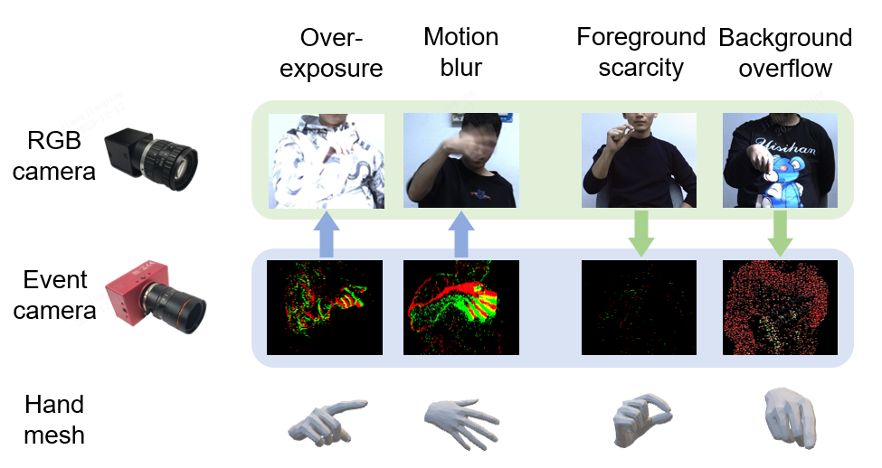
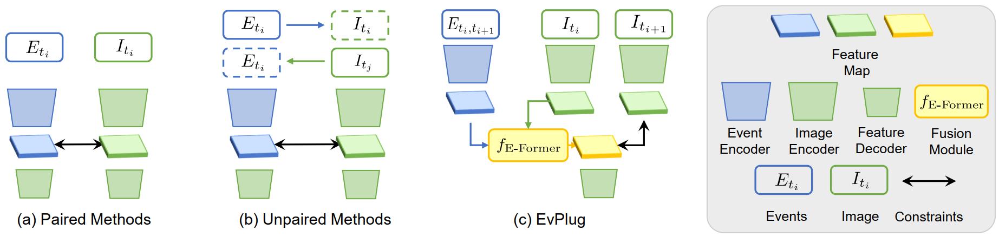

Gradually, I realized that spatial alignment is too foundational in the AR era, while designing effective interactions on a new computing platform is an interesting direction. During this time, I did research on hand pose estimation in the [Camera Intelligence Lab](https://ci.idm.pku.edu.cn/) at Peking University, collaborating for two years with the teams of [Boxin Shi](https://ci.idm.pku.edu.cn/People.htm), [Xiaoming Deng](https://people.ucas.ac.cn/~dengxm), and [Hongbin Zha](https://scholar.google.com/citations?user=LQxSSgYAAAAJ&hl=zh-CN&oi=ao).

I was once attracted by the features of event cameras (HDR, low latency, and low energy consumption), and explored using them for hand pose estimation, hoping to change the performance of basic interaction algorithms at the sensor level.

In the first phase, we conducted hand pose estimation based on a single event camera. We built a multi-camera system to collect a large-scale dataset with precise annotations and designed a weakly-supervised training framework. This exploits the information characteristics of event streams, ensuring robust interaction, as detailed in the paper: [Jiang, Jianping, et al. "EvHandPose: Event-based 3D Hand Pose Estimation with Sparse Supervision." arXiv preprint arXiv:2303.02862 (2023).](https://arxiv.org/abs/2303.02862)

After this work, I realized that using event cameras alone was insufficient for accurate hand pose estimation. However, event cameras and commercial RGB cameras are complementary in imaging. Thus, we developed multimodal fusion methods of these two types of camera data to ensure the accuracy and robustness of the algorithm.

The biggest challenge with new camera forms is the lack of an ecosystem like that of RGB cameras, leading to slow growth in datasets and algorithms in the community. 
Currently, most research on event cameras tends to replicate RGB-based subdomains using event cameras. Their common approach involves collecting a dataset, slightly modifying the event representation and model structure, and then demonstrating high temporal resolution and robust performance. 
I believe this method fails to address the fundamental issues of the event camera community. The growth of new cameras should not be limited to minor, migration-style innovations. Instead, it should start from the differences in imaging dimensions, exploring the correlations between different sensor data modality. 
This approach can effectively leverage the rapidly developing community (such as RGB cameras) to find its own unique path.

One idea was to use the correlation between RGB and event camera imaging to cross-modally distill an event fusion module plug-in from existing RGB-based algorithms and models. 
This approach is versatile, cost-effective, and theoretically elegant, which is my favorite work after two years in this field. 
However, the academic community of event cameras seemed uninterested, with reviewers emphasizing technical contributions in model structure, a divergence I deeply regret.
