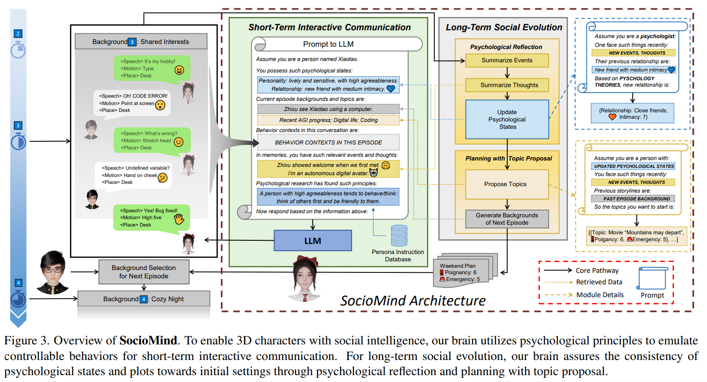

Reflecting on my past research, I've come to a profound realization: 
**One should not let enthusiasm and obsession with a certain technology cloud their judgment of the complex and contradictory needs of ordinary people. The vastness of science and technology excites its participants, but the value of technology lies in its ability to serve the diverse needs of human society.**

Hand pose estimation is indeed a fundamental technology in the XR field. However, as a new form of interactive platform, XR ultimately represents humanity's pursuit of efficiency and happiness in life. Therefore, if we can accurately create diverse, high-quality digital content, it will profoundly impact people's mental world. In the virtual world, building 3D autonomous characters could inspire a wealth of interesting content consumption and social services.

Thus, starting in 2023, I collaborated with [Lei Yang](https://scholar.google.com/citations?user=jZH2IPYAAAAJ&hl=zh-CN&oi=sra)'s team at SenseTime and [Ziwei Liu](https://liuziwei7.github.io/)'s team at NTU on the _Digital Life Project_. My background in psychology inspired me to define what digital life is. By integrating psychological principles into the LLM-Agent framework, we built _SocioMind_, a brain with social intelligence. Connecting this brain with 3D digital characters through text commands forms the initial stage of digital life.

Building a rich and diverse virtual world is a long journey, and the _Digital Life Project_ is just one small step. I am honored to work on this with such talented individuals. Additionally, I am grateful for the psychological advice from [Fei Wang](https://www.psych.tsinghua.edu.cn/info/1180/1542.htm) and [Jinyun Lyu](https://brain.tsinghua.edu.cn/info/1064/1266.htm) from Psychology Department in Tsinghua University, and for the visual communication suggestions from Jingyi Jiang and Wanying Zu.

